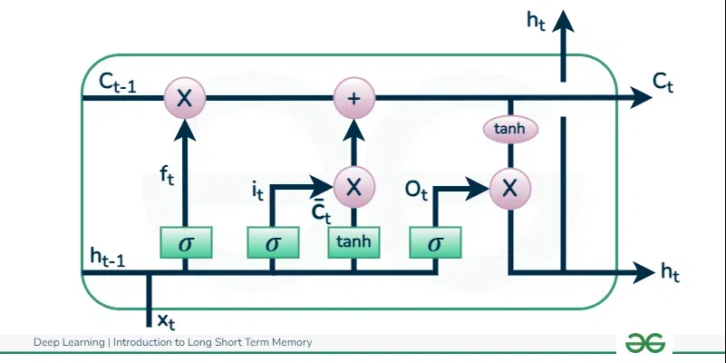

# SpikeInference
A project pertaining to the inference of spiking patterns via Local Field Potential data

###

## Overview
This repository provides a computational framework for predicting single-neuron spiking activity from local field potential (LFP) recordings. The approach leverages a Long Short-Term Memory (LSTM) neural network, which is well-suited for modeling the temporal dynamics inherent in time-series data. By integrating LFP data with neuron population data, the project aims to overcome the challenges associated with single-neuron electrophysiology in humans, providing insights into the neuronal mechanisms that underlie seizure localization.

## Background and Motivation
Acquiring single-neuron electrophysiological recordings in humans is challenging due to the limited use of Behnke-Fried microelectrodes—implanted only when the seizure focus is localized within a small region. In contrast, patients undergoing seizure localization routinely receive sEEG implants that record LFPs, capturing the collective activity of neuronal populations. Traditional methods to infer spiking activity from LFPs have not differentiated between neuronal types. Recent findings suggest that LFPs are predominantly influenced by inhibitory interneurons. This project revisits LFP-based spike prediction, focusing on:
- Disentangling the contributions of inhibitory and excitatory neurons.
- Identifying the role of gamma band activity as a predictor of spiking events.

## Specific Hypothesis
- **Distinct Patterns:** LFPs encode activity that can be dissected into distinct neuronal spiking patterns.
- **Neuron-Type Specificity:** Predictive models based on LFPs will yield more accurate predictions for inhibitory neurons than excitatory neurons.
- **Generalizability:** The relationship between LFPs and spiking activity is expected to generalize across brain regions and hemispheres.
- **Gamma-Driven Predictions:** Gamma frequency components in LFPs are hypothesized to be key drivers in the predictive power of the model.

## Computational Model
The computational framework is built around an LSTM network that processes preprocessed LFP recordings. Key aspects include:
1. **Feature Extraction:** Input features include firing rate, amplitude, and waveform shape obtained through low and gamma band-pass filtering.
2. **LSTM Architecture:** The network uses stacked LSTM layers with dropout to capture long-term temporal dependencies while mitigating overfitting.
3. **Dataset Splitting:** The dataset—aggregated from 31 individual data files—is split into 70% training and 30% validation sets.
4. **Cross-Validation:** A 5-fold cross-validation, stratified by participant, is employed to ensure that the model generalizes across subjects.
5. **Performance Metrics:** Model performance is evaluated using accuracy, sensitivity, specificity, and ROC-AUC. A leave-one-band-out (LOBO) analysis further determines the contribution of specific LFP bands.

## Computational Experiment
30 participants with medically refractory epilepsy were implanted with 1-4 Behnke-Fried microelectrodes containing 8 contacts (608 total contacts) in regions including the hippocampus, amygdala, orbital frontal cortex, and anterior cingulate cortex. 60 seconds of baseline paired single neuron spiking and population LFP were sampled at 30 kHz. Further participant details are described in Cowan et al. 2024

The LSTM model is initially trained on LFP data from the left hippocampus. Its predictive generalizability is subsequently tested on:
- **Right Hippocampus:** To evaluate hemispheric transferability.
- **ACC, OFC, and Amygdala:** To test regional generalizability.

## Repository Structure
    ├── data/                 # Data Directory
    ├── plotting/             # Plots Directory
    ├── utils/                # Utils Directory
    ├   ├── fft.py                  # Plot a FFT of data (confirm main frequencies)
    ├   ├── generate_fake_data.py   # Generate LFP and spike data for proof-of-concept
    ├   └── plot_lfp_data.py        # Plots the generated LFP data and spikes 
    ├── README.md             # This file 
    ├── requirements.txt      # Python package requirements 
    ├── spike_inference.py    # for data loading, model training, and evaluation 
    ├── spike_inference.ipynb # for data loading, model training, and evaluation - but as a python notebook
    └── utils.py              # Utility functions 


## Setup and Installation

### 1. Clone the Repository
Clone the repository to your local machine:
```bash
git clone git@github.com:LeonardoFerrisi/SpikeInference.git
cd SpikeInference
```

### 2. Create a virtual environment using Python 3.8 or later
```bash
python -m venv .venv
```

### 3. Activate the virtual environment

On MacOS, Linux
```bash
source .venv/bin/activate
```  
On Windows: 
```bash
.venv\Scripts\activate
```

### 4. Install Dependencies
```bash
pip install -r requirements.txt
```

## Running the Code:

```bash
python spike_inference.py
```

# More Info

## Algorithms

### Data PreProcessing
- Aggregation: 30 data files are loaded and concatenated to form a comprehensive dataset.
- Splitting: The dataset is divided into training (70%) and validation (30%) sets using `scikit-learn`'s train_test_split function.

### BiDirectional LSTM

#### Rationale

We are using a BiDirectional LSTM because it uses information from both before and after regions of interest in data. This perspective makes it more *acausal* in comparison to an LSTM which only works in one direction. *Acausal* here means it doesnt soley rely on past data but also uses future context to improve predictions.
+ This allows it capture patterns that might be missed if only past data was considered
+ Access to future information can help the model better understand the overall structure of the time series
+ The acausal nature means that, during training and inference (when the whole sequence is available), the model can refine its predictions using context from both ends of the sequence.

See (https://www.geeksforgeeks.org/deep-learning-introduction-to-long-short-term-memory/) for more info



Here is documentation from the BiDirectional LSTM (https://www.geeksforgeeks.org/bidirectional-lstm-in-nlp/)

.jpg)

### Training

- Cross-Validation: 5-fold cross-validation, stratified by participant, ensures robust model evaluation.
- Evaluation Metrics: Accuracy, sensitivity, specificity, and ROC-AUC are computed. A LOBO analysis is conducted to assess the contribution of various LFP frequency bands.

# Project Info


This README.md provides a comprehensive description of the project’s theory, experimental design, algorithms, and step-by-step instructions for setting up and running the code.


# Project Authors
- Leonardo Ferrisi
- Daniel Feldman
- Alana Maluszczak